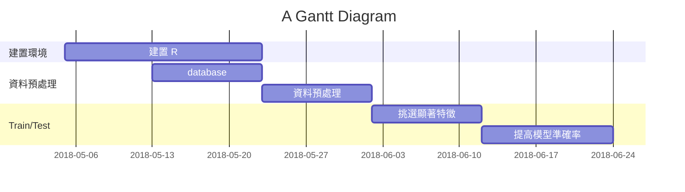

# R predict : House Sales in King County, USA
===
Predict house price using kNN in R

## DATABASE (原始資料)

FROM : kaggle
來源 ： https://www.kaggle.com/harlfoxem/housesalesprediction

## 為何選擇KING COUNTY的資料？

:::info
Ans : 台灣政府資料開放平台較缺少相關完整資料
而且因為是開源專案，希望建立一個**完整的預測範例**
:::

## 環境

> **R** language
 **LINUX** 

:::warning
**本來想使用Rstudio，但跟助教討論過後，覺得在linux下開發R會比在軟體上好:**
- R有許多package是在linux下才能使用的
- 這次的專案要做的是開源專案
- 不知以後會不會有人使用這份專案(?)，所以做linux下開源較好:smiley:
- 再linux下建置環境時可以探索較多未知領域:100:
:::

## what is kNN ?

**kNN ( k-Nearest Neighbors , k 近鄰)**

#### 原理
計算距離，找到測試數據的**k個近鄰**，根據k個近鄰的類別預測測試數據的類別。
:::info
**NOTE :**
kNN 需將各個特徵 **轉換為一個標準** 的範圍 

- 可以應用min-max標準化 ( 所有值落在0~1範圍 )

$$
新數據 = {原數據 - 最小值 \over 最大值 - 最小值}
$$
- 應用z-score 標準化
$$
新數據 = { 原數據 - 均值 \over 標準差 }
$$
:::

#### Example

**測試樣本（綠色圓形）應歸入第一類的藍色方形或是第二類的紅色三角形 ?**
>如果k=3（實線圓圈）它被分配給第二類，因為有2個三角形和只有1個正方形在內側圓圈之內。
>如果k=5（虛線圓圈）它被分配到第一類（3個正方形與2個三角形在外側圓圈之內）。

#### 優點
簡單且有效，對數據分佈沒有要求，訓練階段很快；
#### 缺點
在發現特徵之間的關係上的能力有限，分類階段很慢，需要大量的內存，名義變量和缺失數據需要額外處理

## Schedule

## LINUX 下建置 R 環境
參照 [Technical documents](https://hackmd.io/Eyu32X8sSDOJTJ1YB6dL4Q?both)
## 面臨虛擬機內存不夠的問題
...

## 資料預處理
參照 [Technical documents](https://hackmd.io/Eyu32X8sSDOJTJ1YB6dL4Q?both)

## 參考資料
[R語言進行機器學習方法及實例（一）](https://hk.saowen.com/a/57cac19c62d7cc640dae3471360106c1d0475e09d4c9032621124c9242335c86)

---

